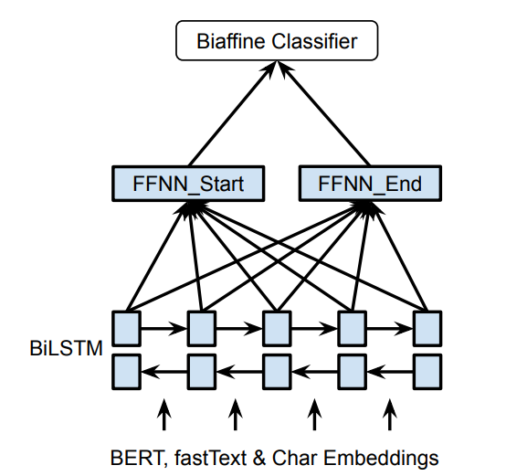

# 概述
1、论文复现《[Named Entity Recognition as Dependency Parsing](https://www.aclweb.org/anthology/2020.acl-main.577.pdf)》。使用双仿射注意力机制Biaffine的思想来进行命名实体识别。<br>
2、模型的具体思路描述可以见[知乎](https://zhuanlan.zhihu.com/p/586309506) <br>
3、训练数据来自于MSRA命名实体识别训练语料，已经做相应的修改转换。<br>


# 环境要求
```
pytorch >=1.6.0
transformers>=3.4.0
```

# 原始数据格式:
```
{"text": "当希望工程救助的百万儿童成长起来，科教兴国蔚然成风时，今天有收藏价值的书你没买，明日就叫你悔不当初！", 
 "entity_list": []
}
{"text": "藏书本来就是所有传统收藏门类中的第一大户，只是我们结束温饱的时间太短而已。", 
 "entity_list": []
}
{"text": "因有关日寇在京掠夺文物详情，藏界较为重视，也是我们收藏北京史料中的要件之一。", 
 "entity_list": [{"type": "ns", "argument": "北京"}]
}
...

```
# 运行步骤
运行`train.py`进行训练<br>
运行`predict.py`进行预测<br>
详细的数据流动过程可参照：https://zhuanlan.zhihu.com/p/586309506

# 项目结构
```
│  eval_func.py  
│  LICENSE
│  predict.py            #预测脚本
│  README.md     
│  train.py              #训练脚本
│
├─checkpoints
├─data                   #数据
│      test.json         
│      train.json
│
├─data_preprocessing
│      data_prepro.py
│      tools.py
│
├─log
├─model
│  │  model.py            #模型结构
│  │
│  ├─loss_function        #损失函数
│  │      binary_cross_entropy.py
│  │      cross_entropy_loss.py
│  │      focal_loss.py
│  │      multilabel_cross_entropy.py
│  │      span_loss.py
│  │
│  └─metrics               #测评函数
│          metrics.py
│
├─output                   #输出文件，预测得到的结果放在这里
│      result.json
│
├─pretrained_model         #改文件夹用来存放预训练模型
│  └─chinese_roberta_wwm_ext
└─utils
        arguments_parse.py  #设置模型训练相关的参数
        logger.py           #存放日志等脚本
```

参照资料：
https://github.com/suolyer/PyTorch_BERT_Biaffine_NER